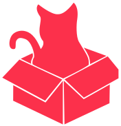
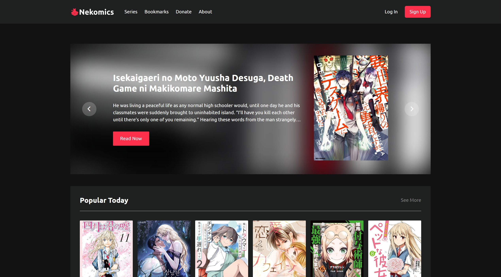

<div align="center">
  <p align="center"></p>
  <h1 style="border: none;">Nekomics: Comic reading website using MangaDex API</h1>
  <div>
    
    
    
    
    
    
  </div>
</div>

## 📋 <a name="table">Table of Contents</a>

1. 🤖 [Introduction](#introduction)
2. ⚙️ [Tech Stack](#tech-stack)
3. 🔋 [Features](#features)
4. 🤸 [Quick Start](#quick-start)

## <a name="introduction">🤖 Introduction</a>

Welcome to Nekomics, your ultimate destination for reading comics from MangaDex. Our responsive platform offers a seamless reading experience for comics from Japan and around the world. Users can log in to save bookmarks and reading history. Additionally, we have integrated Midtrans for donations, allowing generous readers to support us directly.
<br /><br />


## <a name="tech-stack">⚙️ Tech Stack</a>

### Client-Side:
- Vue.js
- Pinia
- Vue Router
- Vue Disqus
- Vue3 Toastify
- TailwindCSS
- Axios

### Server-Side:
- Express
- Sequelize
- PostgreSQL
- Midtrans
- Bcryptjs
- JSON Web Token (JWT)
- CORS
- Axios

## <a name="features">🔋 Features</a>

👉 **Comic Reader Features**:

- Responsive design with TailwindCSS.
- User authentication for saving bookmarks and reading history.
- Integration with MangaDex API for a wide variety of comics.
- Midtrans payment integration for donations.
- Commenting system using Vue Disqus.
- Toast notifications with Vue3 Toastify.

👉 **Development Best Practices**:

- Modular and reusable components.
- State management with Pinia.
- Form validation and error handling.
- Secure user authentication with JWT and bcryptjs.
- Environment configuration with dotenv.
- Automated server restarts with Nodemon.

## <a name="quick-start">🤸 Quick Start</a>

Follow these steps to set up the project locally on your machine.

**Prerequisites**

Make sure you have the following installed on your machine:

- [Git](https://git-scm.com/)
- [Node.js](https://nodejs.org/en)
- [npm](https://www.npmjs.com/) (Node Package Manager)
- [PostgreSQL](https://www.postgresql.org/)

**Cloning the Repository**

```bash
git clone https://github.com/Firkhie/nekomics-app.git
cd nekomics-app
```

### Client-Side:

**Package Installation**

Install the project dependencies using npm:

```bash
cd client-side\client
npm i
```

**Running the Project**

```bash
npm run dev
```

Open [http://localhost:5173](http://localhost:5173) in your browser to view the project.

### Server-Side:

**Package Installation**

Install the project dependencies using npm:

```bash
cd server-side
npm i
```

**Set Up Environment Variables**

Create a new file named `.env` in the root of your project and add the following content:

```env
JWT_SECRET_KEY=
MIDTRANS_SERVER_KEY=

DB_USER=
DB_PASSWORD=
DB_HOST=
DB_PORT=
```

Replace the placeholder values with your actual respective account credentials.

**Initiate Project For the First Time**

Create PostgreSQL database, migrating, and seeding the database

```bash
npm run init
```

**Running the Project**

```bash
npm run dev
```

Open [http://localhost:3000](http://localhost:3000) in your browser to view the project.

#
